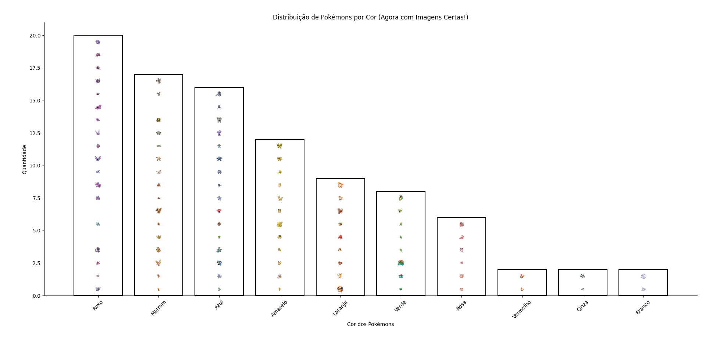
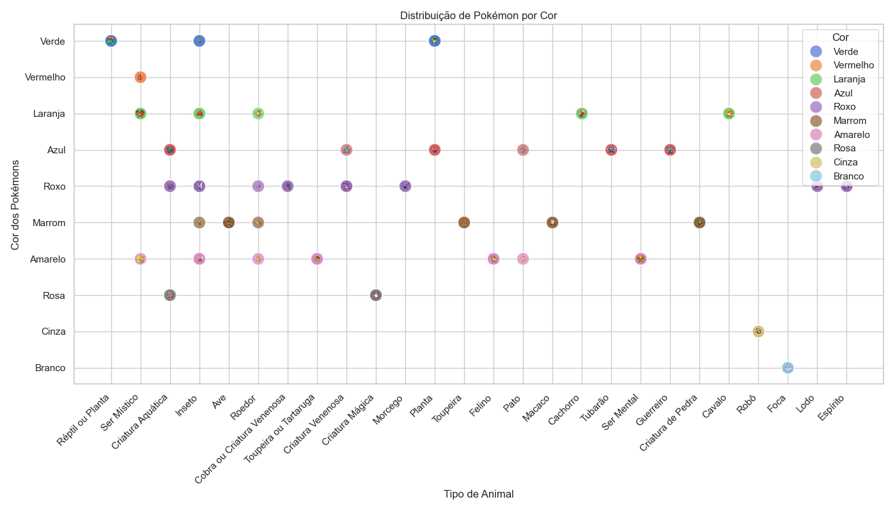
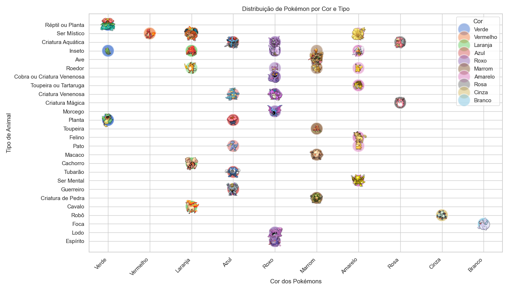
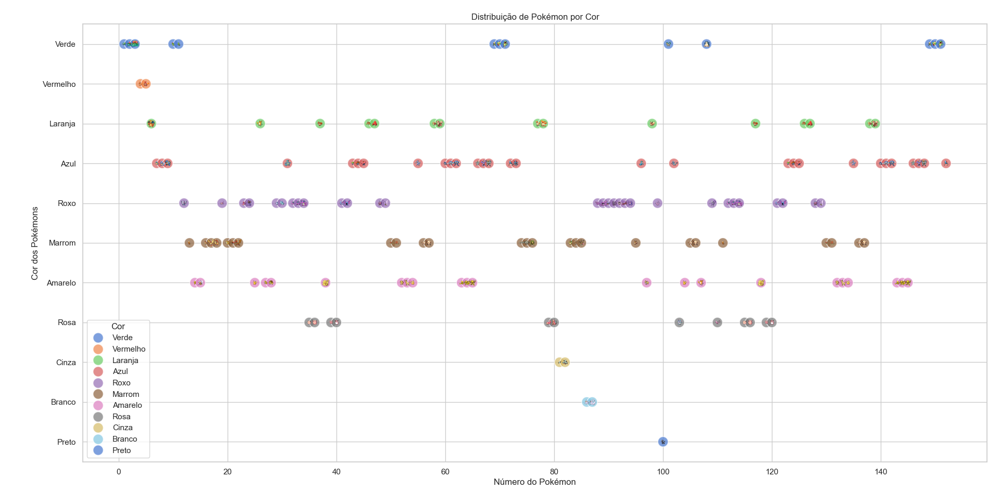
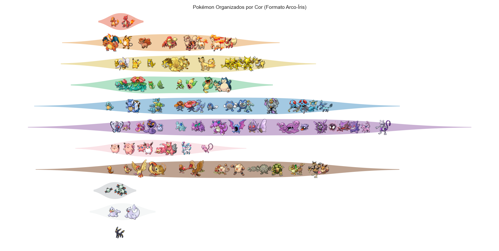
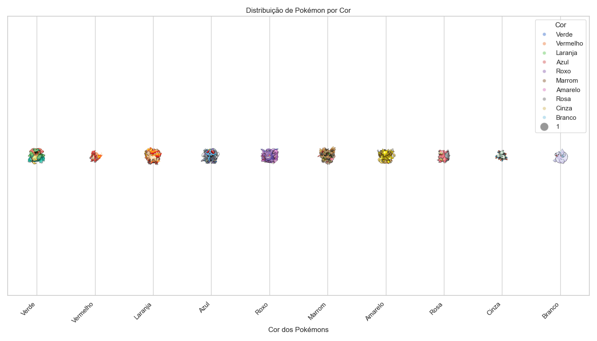
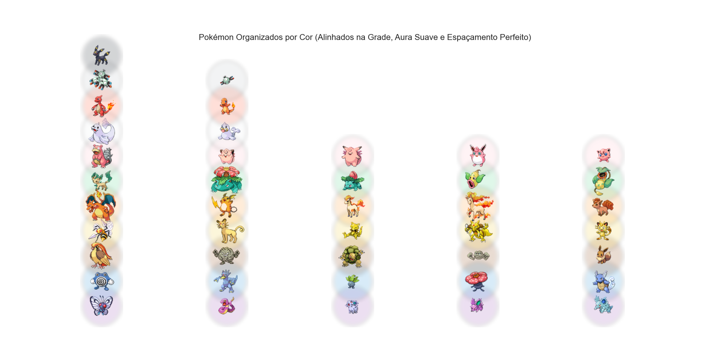
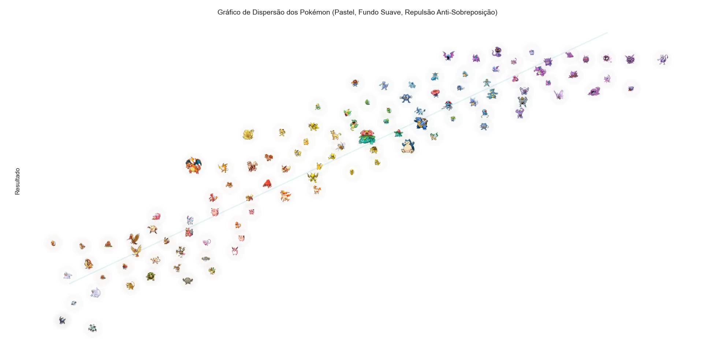
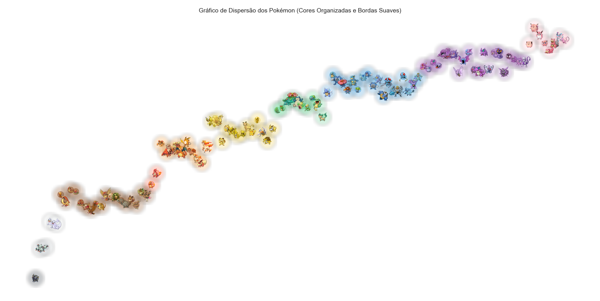
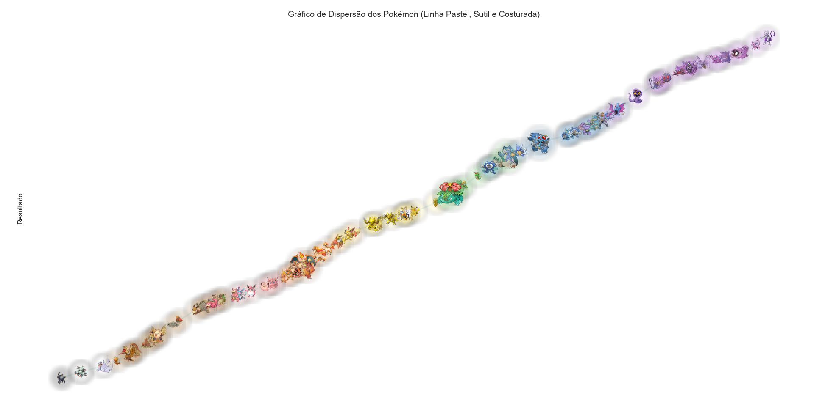

## 🫧𓇼𓏲*ੈ✩‧₊˚🎐Projeto de Visualização de Pokémon com Gráfico de Dispersão

Descrição

Oi, Mia aqui! ฅ(•˕ •マ⟆ Este é um projeto de visualização de dados que cria um gráfico de dispersão com os 151 Pokémon originais. Os Pokémon foram organizados de acordo com suas cores principais, formando um gradiente natural. O projeto conta com ajustes para evitar sobreposição, manter a legibilidade e criar uma estética visualmente agradável.

O resultado final é um gráfico bonitinho, que reflete a distribuição dos Pokémon em um espaço organizado por cores, garantindo que cada um tenha destaque sem aglomerações.

## Etapas do Processo

Importar os dados: Usei um CSV contendo os Pokémon, suas cores principais e nomes.

Remover duplicatas: Porque não preciso de Pokémon clonados (a menos que sejam Dittos infiltrados).

Definir paleta de cores pastéis: Para um efeito visual harmonioso, garantindo que os Pokémon tenham um fundo que combine com suas cores reais.

Ordenar os Pokémon por cor: Seguindo uma sequência lógica e esteticamente coerente.

Criar uma distribuição espaçada: Posicionamos os Pokémon em uma linha orgânica.

Ajustar a repulsão para evitar sobreposição: Assim, nenhum Pokémon esmaga o amiguinho.

Criar os fundos suaves para cada Pokémon: Com uma bolinha colorida de fundo para cada um, SEM bordas!

Ajustar o tamanho dos Pokémon: Porque o Snorlax precisa de um espaço maior que o Pikachu.

Testar diferentes estilos de visualização: Fiz versões com curvas senoidais, repetições e ajuste de opacidade para encontrar o visual perfeito.

Criar versões de linhas de tendência: Realizei testes com linhas transparentes, arco-íris, traçados finos e grossos.

Ajustar a transparência das bolinhas: Para encontrar o balanço entre destacar os grupos e manter os Pokémon visíveis.

Testar diferentes quantidades de Pokémon: Para ver até onde conseguia encaixar todos sem perder legibilidade.

Escolher a versão final: Que ficou agradavalmente do meu ponto de vista estético.

Resultado Final

A versão escolhida tem:

Um fundo suave para cada Pokémon, combinando com sua cor.

Um espaçamento inteligente para garantir legibilidade.

Um efeito visual fluido e natural, sem aglomerações.

Ajustes refinados na transparência, cores e suavidade.

Imagens do Processo

Aqui estão algumas imagens que mostram as diferentes etapas do desenvolvimento, testes de layout, cores e ajustes feitos até alcançar o resultado desejado.

Conclusão

Esse projeto foi uma jornada de ajustes, testes, dores de cabeça e momentos de glória ao ver os Pokémon magicamente organizados em cores suaves. O resultado final é um gráfico digno de uma colecionadora e estudiosa dos pequenos monstrinhos.

Agora sim, o trabalho está impecável e digno de ser exibido. Obrigada a mim mesma pela paciência e persistência! 😆
